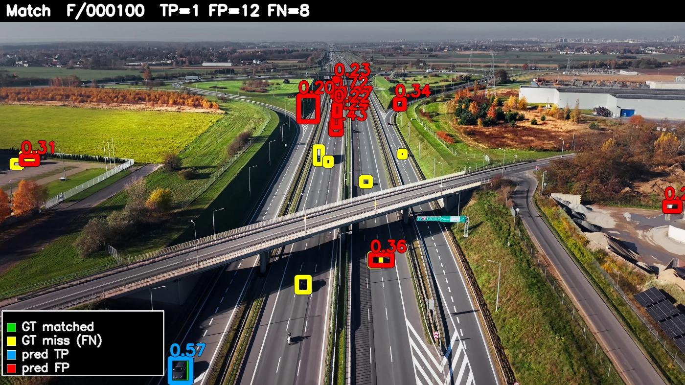
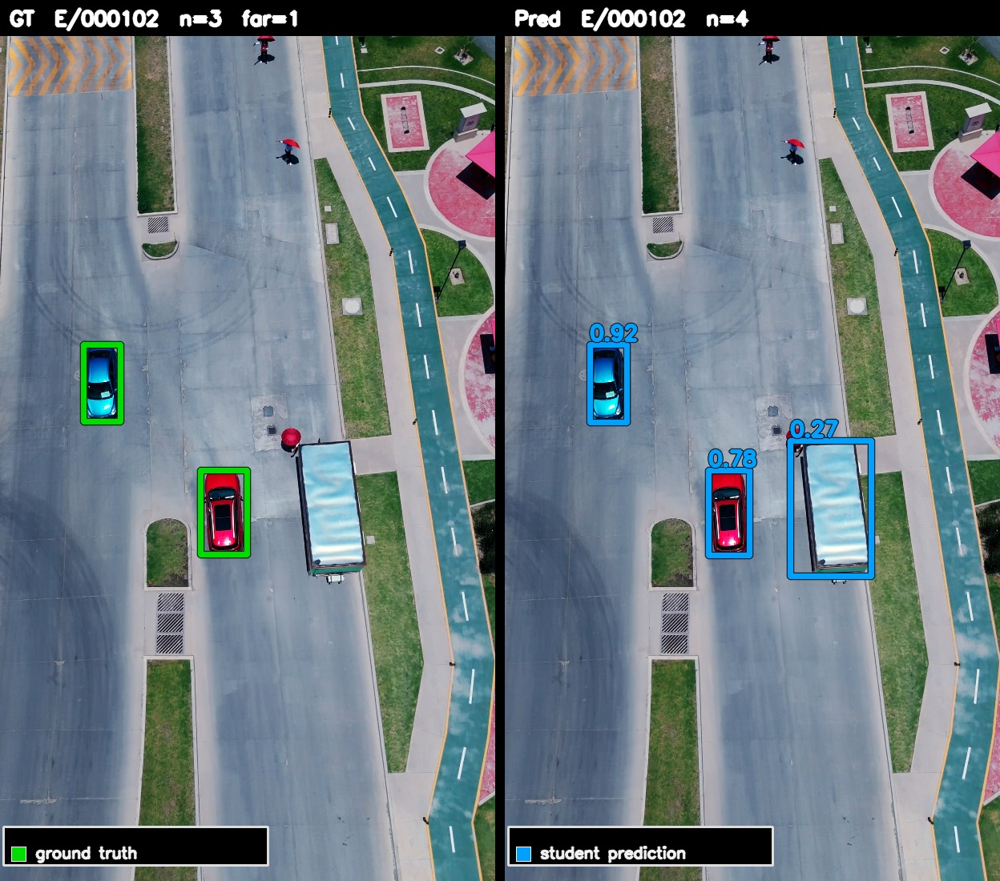
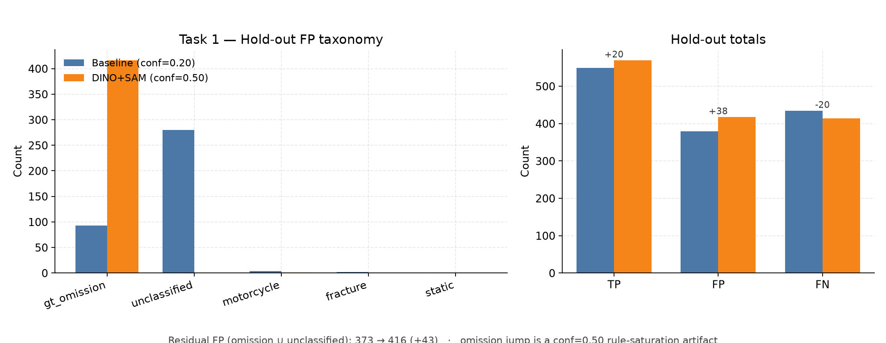
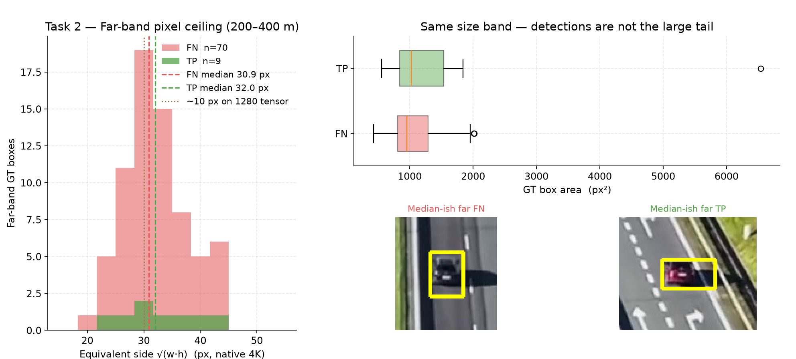
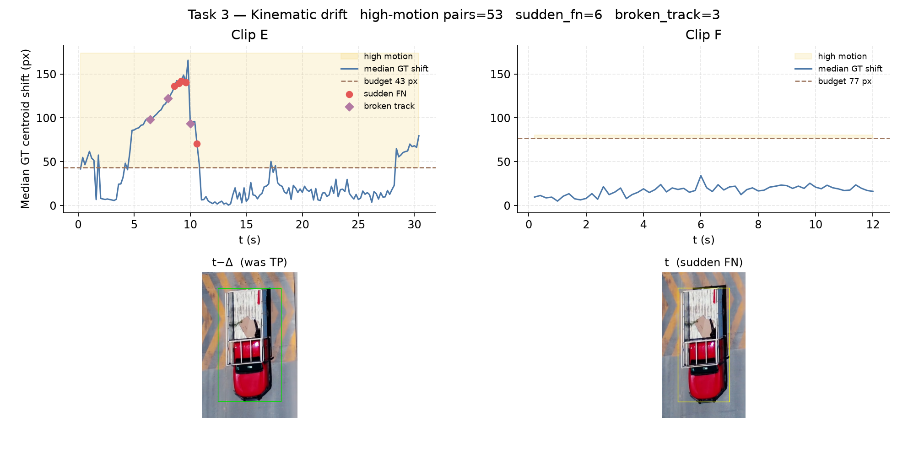

# Aerial vehicle detection — submission showcase

**Prepared by: Kateryna Kozak · Target: ML Engineer · September 2026**

An 8-hour sprint that builds an aerial vehicle detector end to end, on CPU only, for a Raspberry Pi 5 target. One class (`vehicle`), one teacher, nano students, and a hold-out that is never touched until the weights are frozen.

**The constraint set that shaped every decision:**

- **CPU-bound**, no GPU. Student infers at ~288 ms/image at 1280 px.
- **Monocular range only** — no depth sensor, no telemetry. Distance comes from a pinhole model with a fixed \(W_{\mathrm{ref}} = 2.0\,\mathrm{m}\) width prior and \(s_{px} = \min(w, h)\).
- **Scored in two bands**: 0–200 m and 200–400 m. The far band is where everything is hard.
- **Target hardware envelope**: Raspberry Pi 5 (8 GB). Training at `imgsz=1280` on CPU establishes baseline feature learning; edge deployment assumes exporting `best.pt` to ONNX/NCNN with INT8 quantization for sub-50 ms onboard execution. Nothing in this sprint was quantized or benchmarked on-board — that is P1 work, called out below.
- **Domain shift is built into the test.** Train clips (A–D) and hold-out clips (E, F) differ in aspect ratio (16:9 landscape vs. 9:16 portrait), altitude, and mounting pitch. This makes the hold-out a robustness test rather than an in-distribution one, and it explains a large share of the Clip F precision gap.

### Compute budget

Recorded wall-clock on the host CPU. The offline factory dominates; everything the edge model touches is cheap.

| Phase | Environment / tool | Wall-clock | Output / scope |
|-------|--------------------|-----------:|----------------|
| Frame extraction & splits | Python / CPU | minutes | 185 train+val, 214 eval frames |
| YOLO-World teacher run | Ultralytics / CPU, full-frame 1280 | minutes | 1,919 raw pseudo-labels |
| **DINO + SAM factory (train)** | PyTorch / CPU, 2×2 tiles | **~3.6 h** (84 s/frame) | 5,886 mask-derived boxes |
| **DINO + SAM factory (hold-out audit)** | PyTorch / CPU, 2×2 tiles | **~4.5 h** | 2,542 boxes, 89.3% mask-derived |
| Rule re-run over cached boxes | Python / CPU | ~4 s | Threshold tuning without re-inference |
| Student training — clean labels | Ultralytics / CPU, 1280 | **~40 min** (10 ep) | `runs/train/yolo11n/weights/best.pt` |
| Student training — factory labels | Ultralytics / CPU, 1280 | **~35 min** (10 ep) | `runs/train/yolo11n_dinosam/weights/best.pt` |
| Hold-out scoring, taxonomy, diagnostics | Custom Python | minutes | Band metrics, 100-crop audit, 3 figures |

The "minutes" rows were never separately instrumented, so they are reported as an order of magnitude rather than a fabricated number. Caching stage-1 boxes in `runs/cache/dino_sam` is what made the factory tunable at all: every rule change re-runs in ~4 s instead of 3.6 h.

**The headline result:** replacing the noisy zero-shot teacher with an offline **Grounding DINO + SAM data factory** nearly doubled far-band detection on the frozen hold-out (**0.063 → 0.114**) and raised far-band precision (**0.172 → 0.281**). The follow-up diagnostics then proved the remaining gap is **physical and kinematic**, not a labeling problem: far-band targets sit at ~31 px native, which collapses to ~1 cell on the P3 feature map.

---

## Act I — Data isolation and the leak wall

**Commit `6932779`.**

Aerial video at 2 fps has near-duplicate adjacent frames. A random 80/20 split would copy-paste the same vehicle across the train/val boundary and inflate every downstream number. Val is instead the **last 20% of each clip, time-ordered**.

Isolation is enforced in code, not by memory: `src/extract_frames.py` hard-fails if any eval path lands in `train.txt` or `val.txt`.

| Clip | Scene | Train | Val | Eval |
|------|-------|------:|----:|-----:|
| A | interchange, 1920×1080 | 31 | 8 | — |
| B | rural highway, 4K | 50 | 13 | — |
| C | top-down highway, 4K | 27 | 7 | — |
| D | urban intersection, 4K | 39 | 10 | — |
| E | city highway, portrait 2160×3840 | — | — | 153 |
| F | high aerial interchange, 4K | — | — | 61 |

Clips E and F were never used for training, thresholding, or model selection.

**The split is also a domain split.** A–D are 16:9 landscape at low-to-mid altitude; E is 9:16 portrait at 2160×3840 and F is high-altitude 4K. That was partly forced by clip availability and partly kept on purpose — it turns the hold-out into a distribution-shift test. The cost shows up in Act III, where near-band precision drops from 0.818 on E to 0.381 on F.

---

## Act II — Geometric priors and the synthetic FOV

**Commits `8d55020` → `27538de`.**

The teacher (YOLO-World, `conf=0.15`, full-frame at 1280) is deliberately recall-first; precision is bought back in cleanup. Hand cleanup grew the train set **1919 → 2207** boxes and **deleted every two-wheeler** — a 0.8 m motorcycle scored against a 2.0 m width prior projects into the wrong distance band entirely.

Then the range model exposed a trap. At a textbook 70° vertical FOV, **100% of 2207 boxes** landed in 0–200 m (max projected range 199.5 m). A student trained on that has no far-band supervision at all.

| FOV_v | 0–200 m | 200–400 m |
|------:|--------:|----------:|
| **40° (locked)** | **1756** | **451** |
| 70° | 2207 | 0 |
| 90° | 2207 | 0 |

Locking `fov_v_deg: 40.0` in config — a stated prior, not a calibration — restored **451** far-band training targets at a native short-side median of **10.9 px**.

---

## Act III — Hold-out expansion and the frozen baseline

**Commits `db74849` → `1f63d55`.**

Clip E audited at **one** 200–400 m ground-truth box. A far-band recall metric on \(n=1\) is a coin flip, not a measurement. Adding the high-altitude Clip F contributed **78** far targets, taking the hold-out far band from **1 → 79**.

Thresholds were swept on **val only** (`conf=0.20`, mean-band F1 0.649), frozen to JSON, and the hold-out was scored exactly once.

| Metric | YOLO11n 0–200 m | YOLO11n 200–400 m |
|--------|----------------:|------------------:|
| Detection rate | 0.602 | 0.063 |
| Precision | 0.605 | 0.172 |
| False alarms / min | 99.5 | 6.7 |
| Time to first detection | 0.0 s | 0.4 s |

| Clip | Near Det / Prec | Far Det / Prec |
|------|----------------:|---------------:|
| E | 0.997 / 0.818 | 1.0 / 0.333 (n=1) |
| F | 0.318 / 0.381 | 0.051 / 0.154 |

Near band is effectively solved on E and unsolved on F. Far band is the bottleneck: **5 of 79** true positives.

The E-to-F spread is the domain gap made numeric. F is higher, wider, and framed differently from anything in A–D, so it contributes almost all the false alarms and nearly all the far-band misses. Reading this as a single averaged score would hide the fact that the model is competent in-domain and fragile out of it.

**Clip F, hardest frame** — GT matched green, GT miss yellow, pred TP blue, pred FP red:



**Clip E, best far-band coverage:**



---

## Act IV — Foundation-model distillation

**Commits `c4b52ac` → `1c097ee`.**

The error taxonomy said the label pipeline, not the detector head, was the limit. So the teacher plus human cleanup loop was replaced with an offline factory: **Grounding DINO** (`"vehicle."`) → **SAM** masks → tight boxes → schema and kinematic rules.

- **Tiling is mandatory, not an optimization.** DINO letterboxes to ~800 px, so a 10 px vehicle in 4K lands at ~3 px. Each frame runs as **2×2 overlapping tiles plus a full-frame pass**, merged with class-agnostic NMS at 0.55.
- **SAM supplies the geometry.** 92.6% of final boxes come from a mask; median IoU **0.799** and area ratio **0.955** against human labels — roughly **4.5% tighter** on the same vehicle, which is exactly what the width prior wants.
- **Output:** 7016 raw → **5886** final boxes, 796 truck merges, 192 two-wheelers purged by rule.

The A/B on the frozen hold-out, factory student at its own val-frozen `conf=0.50`:

| Metric | Clean 0–200 m | DINO+SAM 0–200 m | Clean 200–400 m | DINO+SAM 200–400 m |
|--------|--------------:|-----------------:|----------------:|-------------------:|
| Detection rate | 0.602 | **0.619** | 0.063 | **0.114** |
| Precision | **0.605** | 0.587 | 0.172 | **0.281** |
| F1 | 0.603 | 0.603 | 0.093 | **0.162** |
| False alarms / min | **99.5** | 110.5 | 6.7 | **6.4** |
| Time to first detection | 0.0 s | 0.0 s | 0.4 s | **0.2 s** |

Mean-band selection score moved **0.348 → 0.383**. Far-band true positives went **5 → 9** of 79, and Clip F near-band detection climbed **0.318 → 0.420** with precision **0.381 → 0.555**.

An independent audit backs the label story: running the factory over the frozen hold-out reproduces **374 of 379** manually QA'd boxes on Clip E (**0.987** recall), and confirms **~44%** of the student's reported false alarms as real vehicles the proxy GT missed.

**Annotated hold-out video, factory student** (green matched GT, yellow missed GT, blue TP, red FP, with a live TP/FP/FN banner):

- [`outputs/videos/eval_E_dinosam.mp4`](outputs/videos/eval_E_dinosam.mp4) — Clip E, ~30.6 s
- [`outputs/videos/eval_F_dinosam.mp4`](outputs/videos/eval_F_dinosam.mp4) — Clip F, ~12.2 s

*If the videos do not play inline — GitHub does not stream MP4s from private repos — click through to download or view raw.*

---

## Act V — Differential diagnostics and the human audit

**Commit `f7ece56`.**

**Taxonomy delta — read the artifact, not the raw count.** `gt_omission` false positives appear to explode 93 → 416, but the factory's frozen `conf` (0.50) *equals* the rule's trigger threshold, so every survivor gets that tag. The honest number is the residual bucket: **373 → 416**, while true positives rose 549 → 569 and misses fell 434 → 414.



**The far band is a resolution floor, not a data gap.** Far-band true positives have a median area of **1026 px²** (~32 px side); missed ones sit at **954 px²** (~31 px side). The distributions overlap almost completely — misses are not a tail of extra-tiny objects. After the 4K → 1280 letterbox, a 31 px footprint is ~10 px on the tensor, about **one cell on P3** (stride 8). More labels cannot recover an object that occupies a single feature cell.



**Tracking breaks on ego-motion, not on appearance.** Across 53 high-motion frame pairs (median GT centroid shift ≥ 2% of image width), the run logged **6** sudden TP→FN flips and **3** broken track IDs — all on Clip E during a single ~6–11 s pitch/yaw spike. Clip F logged zero.



**100-crop human audit** (top-50 residual FPs by confidence, top-50 near-band FNs by area):

| False positives | Share | | False negatives | Share |
|-----------------|------:|--|-----------------|------:|
| gantry sign | 32% | | motion blur | 38% |
| shadow / glare | 20% | | truncated at frame edge | 38% |
| infrastructure pole | 18% | | articulated truck | 16% |
| proxy-GT miss / partial vehicle | 22% | | label noise | 8% |

**70%** of high-confidence false alarms are real infrastructure clutter — not missing labels. Near-band misses are dominated by ego-motion blur and FOV truncation, which is the same story Task 3 tells.

---

## Road to production

**P0 — algorithmic and data**

1. **Hard-negative mining on gantries, poles, and glare.** This is 70% of high-confidence false alarms and the single cheapest precision win available.
2. **Break the ~31 px spatial floor.** Inference-time slicing (SAHI) or a P2 detection head; a higher input size is the blunt version. Another training epoch will not move this.
3. **Truck-aware geometry for Clip F.** Articulated vehicles account for 16% of near-band misses on the high-altitude clip.
4. **Sensor and domain alignment.** Train and hold-out clips differ in aspect ratio (16:9 vs. 9:16), altitude, and mounting pitch — useful as a robustness probe, wrong as a production setup. Collection must be pinned to the actual payload: fixed focal length, a declared operational altitude envelope, and a fixed mounting pitch. That also retires the synthetic 40° FOV prior in favor of a measured one, which removes the largest unvalidated assumption in the distance math.

**P1 — hardware and edge integration**

5. **Pi 5 VIO with IMU fusion.** The 9 kinematic drift events are a stabilization problem. Compensating ego-motion in hardware is far cheaper than asking a nano detector to learn translation invariance.
6. **Export and quantize.** `best.pt` → ONNX/NCNN at INT8, then measure on-board latency against the sub-50 ms target and calculate the quantization accuracy penalty. The ~288 ms/image host figure is not a Pi number and should not be quoted as one.
7. **Sensor path over model path for far range.** Optical zoom or a higher-resolution capture mode addresses the physics the P3 floor exposes.

---

## Key submission artifacts

| Artifact | Path |
|----------|------|
| Factory student weights | `runs/train/yolo11n_dinosam/weights/best.pt` |
| Baseline student weights | `runs/train/yolo11n/weights/best.pt` |
| Annotated hold-out videos *(download or view raw if inline playback fails)* | [`outputs/videos/eval_E_dinosam.mp4`](outputs/videos/eval_E_dinosam.mp4), [`outputs/videos/eval_F_dinosam.mp4`](outputs/videos/eval_F_dinosam.mp4) |
| Diagnostic figures | `outputs/diagnostics_final/task{1,2,3}_*.png` |
| 100-crop human audit | `outputs/audit/edge_cases/audit_tags.csv`, `data/splits/audit_summary.json` |
| Curated example frames | `outputs/examples/` + `manifest.json` |
| Frozen thresholds & band metrics | `data/splits/eval_thresholds*.json`, `data/splits/eval_metrics*.json` |
| Head-to-head A/B | `data/splits/eval_ab_clean_vs_dinosam.json` |
| Error taxonomies (both students) | `data/splits/error_taxonomy_{baseline,dinosam}.json` |

---

## Reproduce

```bash
python src/extract_frames.py --config configs/data.yaml   # leak wall
python src/auto_label_dino_sam.py                         # data factory, ~3.6 h CPU
python src/train.py --models yolo11n --epochs 10 --labels-dir data/labels/auto_generated --run-suffix _dinosam
python src/evaluate_custom.py --tune-val --score-eval      # freeze on val, score hold-out once
python src/final_diagnostics.py                           # taxonomy delta, pixel ceiling, drift, audit pack
```

Full engineering log, every threshold probe, and the decisions behind each number: [`README.md`](README.md).
